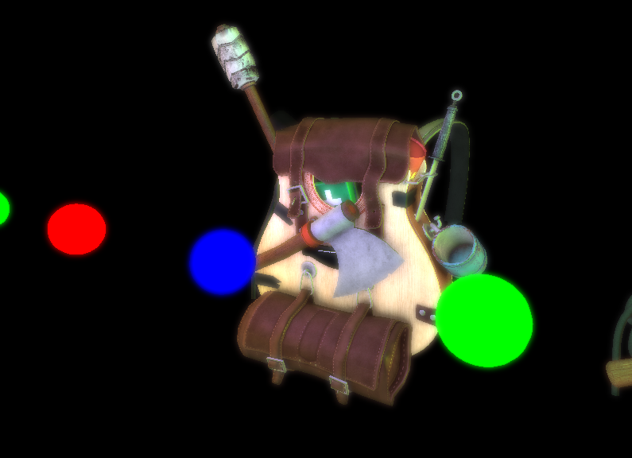
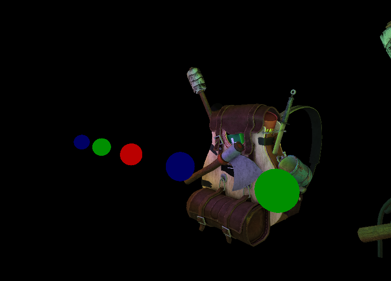
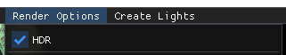

# PGAEngine

This is a rendering engine made for the subject PGA of the CITM(UPC). This engine implements the forward and deferred technique and also implements bloom and relief mapping.

## Deferred and forward shading

Implements the deferred and forward rendering techniques. You can also visualize the different textures of the G-buffer.

## Relief Mapping

## Bloom

This engine implements the bloom technique. This technique makes the texture output look a little bit blurry, making the illusion that there's too much light.

Here you can see an image with bloom.

And this one is without bloom.

In addition with bloom and in order to make it look better, the High Dynamic Range is also implemented. You have a checkbox in the menu to activate and deactivate it.

## Controls

The following controls must be done pressing the right mouse button):
- W: Moves camera forward
- A: Moves camera left
- S: Moves camera backward
- D: Moves camera right
- Q: Moves camera up
- E: Moves camera down
- Moving the mouse: Rotates the camera
- Moving the mouse while pressing LEFT ALT: Orbit the camera

## Shaders used

- : This one renders all the entities on the scene.
- : This one creates the blurry image that it is used to combine with the final scene texture.
- : This one is used to render the objects with relief mapping.
- : This one renders all the lights to see where are they positioned.
- : This one is used to render the final quad in deferred mode.
- : This one is used to render the final quad in forward mode.
